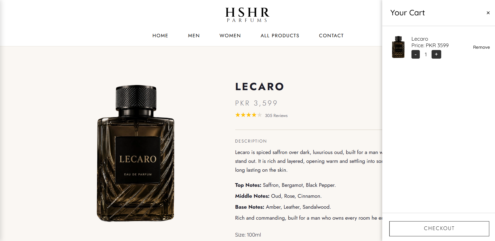
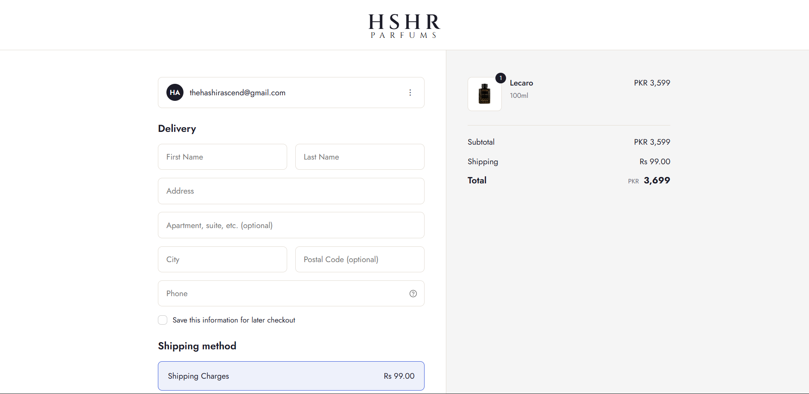

# HSHR Parfums

A luxury perfume e-commerce portfolio site built to showcase full-stack web development and design skills. This is a **portfolio/demo project** not a real store.

**Live Demo:** https://hshr-parfums-hashir.netlify.app/

## Preview

## Tech Stack

- **Frontend:** HTML5, CSS3, Vanilla JavaScript
- **Backend / Database:** Supabase (Auth, Postgres, Storage)
- **Animation:** GSAP (page transitions, scroll effects)
- **Deployment:** Netlify

## Features

- Multi-page storefront (Home, Men, Women, Twins/Gift Sets, All Products, Product Detail, Checkout, Contact)
- Google OAuth + email authentication via Supabase
- Persistent shopping cart with quantity limits and Supabase-backed orders
- Live product search with suggestions
- Fully responsive design (desktop, tablet, mobile) with a mobile hamburger nav
- Animated hero banner, page-transition overlay, and marquee banners
- Order confirmation flow with success modal

## Pages

| Page | Description |
|---|---|
| `Perfume.html` | Homepage with hero banner and featured collections |
| `Men.html` / `Women.html` | Category listings |
| `Twins.html` | Paired gift-set products |
| `Products.html` | All products with sort/filter |
| `Product.html` | Product detail page |
| `Checkout.html` | Cart checkout and order placement |
| `Contact.html` | Contact information |

## Notes

This project was built as a personal learning/portfolio exercise to practice full-stack development, UI/UX design, and working with a real backend (Supabase) in a vanilla JS environment without a framework.

## Author

**Hashir Tareen**
Email: iamhashirshakeel@gmail.com
Instagram: [@heishashir](https://www.instagram.com/heishashir/)
